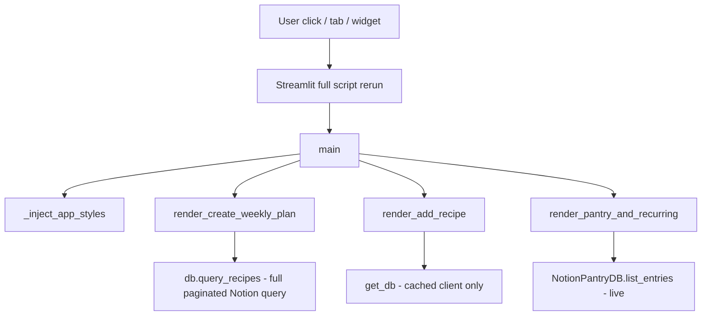

# Streamlit UI performance research

**Issue:** [#128](https://github.com/rachelgramlich/personal-repo/issues/128)
**Scope:** Research and recommendations only (implementation staged in follow-up issues).
**Primary code:** `src/grocery_wizard/ui/app.py` (~1,760 lines, single entry script).

## Executive summary

Everyday slowness (buttons, tabs, navigation) is expected with the current design: Streamlit **reruns the entire script** on each interaction, and this app **always executes all three top-level tabs**, **injects a large CSS block every run**, and **hits Notion on most reruns** without caching recipe or pantry data. Network latency to Notion dominates perceived delay once the recipe database is non-trivial.

**Recommended path:** Stay on Streamlit for now. Ship **Phase 1** quick wins (cached Notion reads, tab isolation via `st.fragment` or multipage, avoid redundant `query_recipes`) for the largest gain with low risk. Revisit stack choice only if Phase 2–3 still feel unacceptable after measurement.

| Phase | Focus | Rough effort | Expected impact |
| --- | --- | --- | --- |
| **1** | Cache + dedupe Notion reads; lazy tabs | 2–4 days | High — often cuts rerun time by 50–90% when Notion-bound |
| **2** | Split `app.py`, fragments, slimmer widgets | 3–5 days | Medium — faster Python + less DOM work |
| **3** | Instrumentation, TTL/invalidation policy, optional local snapshot | 2–3 days | Medium — predictable freshness vs speed |
| **4+** | Alternative UI stack or SPA rewrite | weeks–months | High UX ceiling; high migration cost |

---

## How the UI runs today



### Streamlit rerun model

- Any widget change triggers a **top-to-bottom rerun** of `app.py`.
- `st.tabs()` **does not skip** inactive tab bodies; all three `render_*` functions run unless guarded (e.g. `@st.fragment`, multipage apps, or early `return` based on session state).
- `st.rerun()` is used after many actions (save, remove pantry item, plan mode changes), so users pay a full rerun cost repeatedly.

### Notion / I/O on interaction

| Call site | When it runs | Notes |
| --- | --- | --- |
| `get_db()` | Most tab renders | `@st.cache_resource` — client + schema load once per process |
| `db.query_recipes()` | Weekly tab (when plan entry complete); grocery meal links; recipe review start | **Full paginated query every rerun** — no `st.cache_data` |
| `find_by_link()` → `query_recipes()` | Add Recipe preview | **Second full recipe scan** per preview action |
| `_load_pantry_entries_from_notion()` | **Every rerun** while Pantry tab code path executes | Comment in code: *"no caching — always live query"* |
| `list_saved_plans()` / `load_plan_recipes()` | Weekly plan entry UI | Notion household DB queries |
| `_matching_saved_plan()` / save flows | Save controls | Additional Notion reads/writes |

Recipe count scales linearly: each `query_recipes()` loop paginates until `has_more` is false (`integrations/notion.py`).

### Other costs

- **Monolithic script:** planning, grocery review, pantry, and add-recipe in one file — lots of widget tree construction even when the user only toggled one checkbox.
- **Heavy CSS** (~200 lines) via `st.markdown(..., unsafe_allow_html=True)` on every rerun.
- **Copy buttons** via `st.iframe` + inline HTML/JS — extra iframe elements on grocery result views.
- **Session state sync patterns** (fingerprints for text areas, ingredient index keyed off recipe set) are correct for Streamlit semantics but add branching on every rerun.
- **Ingredient index** is cached in session state when the recipe set fingerprint changes — good pattern; Notion fetch is the gap.

### What is already optimized

- `@st.cache_resource` on `get_db()` avoids reconstructing the Notion client and re-fetching DB schema every run.
- Ingredient index for meal planning is stored in `st.session_state` keyed by a recipe-set fingerprint.
- Grocery result is cached in `st.session_state.grocery_result` until the meal plan changes (`_invalidate_stale_grocery_result`).

---

## Root-cause hypotheses (ranked)

1. **Notion round-trips on every rerun (high confidence)**
   Weekly tab calls `query_recipes()` whenever the user is past plan entry. Pantry tab always lists pantry from Notion. Even a single checkbox on the weekly flow re-fetches all recipes.

2. **All tabs execute on every interaction (high confidence)**
   Clicking "Add to pantry" reruns weekly plan logic (including `query_recipes()` when the weekly workflow is active).

3. **Network + serialization (medium confidence)**
   Notion API latency (100ms–several seconds per call depending on region, pagination, and payload) blocks the single Python thread Streamlit uses for the script.

4. **Large widget tree / DOM updates (medium confidence)**
   Many expanders, text areas, per-row remove buttons, and multiselects increase server render + browser diff time — noticeable on slower devices but usually secondary to Notion.

5. **Cold start / deployment (low–medium confidence)**
   First load after idle (Streamlit Cloud, local sleep) adds startup; distinct from "every click feels slow."

6. **Duplicate work inside one rerun (medium confidence)**
   Multiple code paths call `query_recipes()` independently (`find_by_link`, `_start_recipe_review`, `build_grocery_list`, `_meal_entries_with_links`) within the same session.

---

## Profiling plan (before/after each phase)

### Quick manual timing

Wrap suspect blocks temporarily:

```python
import time
t0 = time.perf_counter()
all_recipes = db.query_recipes()
st.sidebar.caption(f"query_recipes: {time.perf_counter() - t0:.2f}s")  # dev only
```

Use Streamlit **Settings → Run on save** off while measuring so saves do not skew results.

### Structured options

| Tool | Use |
| --- | --- |
| `cProfile` / `py-spy` on `streamlit run ...` | Find Python hotspots (parsing, grouping, Notion client) |
| Browser DevTools → Network | See rerun WebSocket latency vs idle |
| Streamlit `st.cache_data` stats (logging) | Verify cache hit rate after Phase 1 |
| Optional: `@st.fragment` run counts | Confirm inactive regions skip work |

### Success metrics (suggested)

- **P95 rerun time** with a warm cache and typical recipe count (e.g. 150, 400 rows).
- **Notion API calls per rerun** (target: 0 for pantry-only edits after lazy tabs; 0–1 cached reads for weekly-only edits).
- **Subjective:** tab switch and primary buttons feel "instant" (<300ms local) or "acceptable" (<1s remote Notion).

---

## In-app refactor options (Streamlit)

### A. Cache Notion reads with explicit invalidation (Phase 1 — **recommended first**)

- Add `@st.cache_data(ttl=…)` wrappers, e.g. `load_all_recipes()`, `load_pantry_entries()`, `load_saved_plans()`, keyed by a **data revision** or manual "Refresh from Notion" button.
- Invalidate cache on mutations: `create_recipe`, pantry add/remove, plan save — call `st.cache_data.clear()` or bump a session `notion_cache_generation` counter passed into cache keys.
- Fix `find_by_link` to query Notion with a **filter** (link URL) instead of scanning all recipes in Python.

**Tradeoffs:** Stale data for TTL window if invalidation misses a path; must audit all write paths.
**Effort:** ~1–2 days. **Impact:** High.

### B. Lazy tab execution (Phase 1)

Options (compatible with current deployment):

1. **`@st.fragment`** (Streamlit ≥1.33): wrap each tab body so only the fragment containing the triggering widget reruns (when supported for that interaction).
2. **Multipage app** (`pages/`): true navigation isolation — only one page script runs.
3. **Session guard:** `active_tab` in session state + radio instead of `st.tabs` — only call one `render_*` per rerun (simplest, slightly different UX).

**Tradeoffs:** Fragments have edge cases with cross-tab state; multipage changes URL structure.
**Effort:** 1–2 days. **Impact:** High when users live in one tab.

### C. Single recipe fetch per rerun (Phase 1)

- At start of weekly render: `all_recipes = load_all_recipes_cached()` once; pass through call chain.
- Thread the same list into `_meal_entries_with_links`, `_start_recipe_review`, and `build_grocery_list` (add optional `recipes: list[Recipe] | None` parameter) to avoid duplicate queries in one run.

**Effort:** ~1 day. **Impact:** Medium (helps even before caching).

### D. Modularize `app.py` (Phase 2)

- Split into `ui/pages/` or `ui/sections/` modules; keep thin `app.py`.
- Easier to apply fragments and unit-test pure helpers.

**Effort:** 2–3 days. **Impact:** Maintainability; indirect perf via smaller reruns.

### E. Reduce DOM weight (Phase 2)

- Replace per-item `st.button("x")` rows with `st.data_editor` or batched forms where feasible.
- Move copy-to-clipboard to a shared static component or `st.components.v1` once.
- Load CSS from `static/` or `.streamlit/config.toml` theme instead of inline markdown every run.

**Effort:** 2–4 days. **Impact:** Medium on large pantry lists.

### F. Background refresh / optimistic UI (Phase 3)

- Show last cached recipes immediately; refresh in background on interval or on focus.
- Requires careful UX for conflicts when Notion changed elsewhere.

**Effort:** 3–5 days. **Impact:** High perceived speed; more complex.

### G. Local read replica (Phase 3)

- Periodic CLI job (`dev refresh-recipe-cache`) writes JSON snapshot; UI reads local file and optionally syncs.
- Aligns with existing CLI-first workflows in this repo.

**Tradeoffs:** Operational step; freshness policy needed.
**Effort:** 3–4 days. **Impact:** High for large DBs.

---

## Alternative Python UI stacks

All can reuse existing `src/grocery_wizard/*` domain logic (planning, grocery_list, Notion integrations).

| Stack | Fit | Pros | Cons | Effort to reach parity |
| --- | --- | --- | --- | --- |
| **Streamlit + fragments/cache** | Best short-term | Keep current UX; smallest diff | Rerun model limits ceiling | Days |
| **NiceGUI** | Good | Fast reactive UI; still Python | Different component model; hosting | 1–2 weeks |
| **Reflex** | Moderate | Full web app in Python | Heavier framework; build pipeline | 2–4 weeks |
| **FastAPI + HTMX** | Good | Fine-grained requests; no full rerun | Write HTML/templates | 2–3 weeks |
| **FastAPI + React/Vue SPA** | Long-term | Best interaction latency | Two languages; API layer | 1–3 months |
| **Gradio** | Poor fit | Quick demos | Awkward for multi-tab planner UX | N/A |
| **Panel / Dash** | Moderate | Reactive plots + apps | Learning curve; less common here | 2–3 weeks |

**Compatibility note:** Project already depends on `streamlit>=1.39` and documents `just grocery-ui`. Any migration should keep CLI paths unchanged.

---

## Heavier options (non-Python front end)

| Approach | When it makes sense | Effort |
| --- | --- | --- |
| **REST/GraphQL API + SPA** | Team wants mobile-quality UX or offline | 2–4 months |
| **Tauri/Electron shell** | Desktop-only power users | 1–2 months + API |
| **Rewrite in Next.js etc.** | UI becomes product surface | 3+ months |

Justification threshold: Phase 1–3 fail metrics **and** UI is a primary daily driver for multiple users — not yet required for a personal Notion-backed tool if caching fixes land.

---

## Recommended roadmap

1. **Measure** with sidebar timings + count Notion calls on a representative DB size.
2. **Phase 1 (ship first):** cached `query_recipes` / pantry / saved plans + invalidation; lazy tabs or multipage; dedupe per-rerun fetches; Notion-filtered `find_by_link`.
3. **Phase 2:** split modules, slim pantry list UI, externalize CSS.
4. **Phase 3:** "Refresh from Notion" control, TTL policy doc, optional JSON snapshot for offline-speed reads.
5. **Re-evaluate stack** only if P95 rerun > ~1s after Phase 1–2 with warm cache.

---

## Proposed follow-up implementation issues

Create these (or equivalent) when starting implementation work:

| Title | Scope |
| --- | --- |
| **UI perf Phase 1: cache Notion reads with mutation invalidation** | `st.cache_data` wrappers for recipes, pantry, saved plans; audit write paths; manual refresh button |
| **UI perf Phase 1: lazy tab / fragment isolation** | Stop running weekly + add-recipe + pantry on every widget event |
| **UI perf Phase 1: dedupe query_recipes and filter find_by_link** | Single fetch per rerun; Notion API filter for URL lookup |
| **UI perf Phase 2: split Streamlit app into modules** | `ui/sections/` without behavior change |
| **UI perf Phase 2: lighten pantry/recurring list rendering** | Fewer buttons/iframes; form-based bulk remove |
| **UI perf Phase 3: optional local recipe snapshot for UI** | CLI refresh + read path in UI with freshness indicator |

---

## References in repo

- Entry point: `src/grocery_wizard/ui/app.py` — `main()`, `get_db()`, tab renders
- Notion pagination: `src/grocery_wizard/integrations/notion.py` — `query_recipes()`
- Pantry live load: `_load_pantry_entries_from_notion()` in `app.py`
- Grocery list duplicate fetch: `src/grocery_wizard/shopping/grocery_list.py` — `build_grocery_list()`
- Streamlit run: `just grocery-ui` / `src/grocery_wizard/README.md` § Streamlit UI
